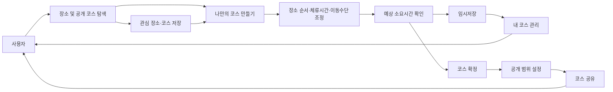
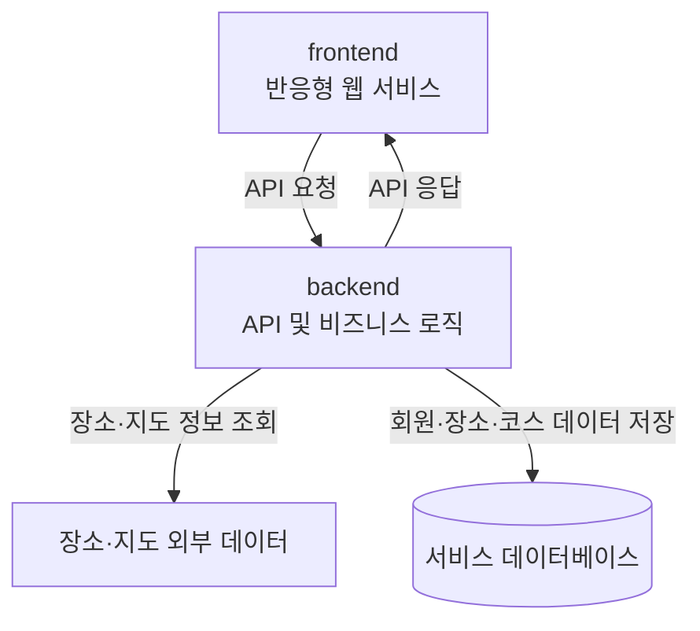

<div align="center">

# ToDayIt

### 장소 탐색부터 코스 구성과 공유까지 이어지는 데이트 코스 플랫폼

데이트 장소를 따로 검색하고 일정을 다시 맞추는 번거로움을 줄이고, 취향과 일정에 맞는 데이트 코스를 만들 수 있도록 지원합니다.

</div>

---

## 프로젝트 개요

| 구분 | 내용 |
| --- | --- |
| 프로젝트명 | ToDayIt |
| 프로젝트 형태 | 데이트 장소 탐색 및 코스 구성 플랫폼 |
| 플랫폼 | 반응형 웹 |
| 주요 사용자 | 데이트 장소를 찾거나 취향과 일정에 맞는 코스를 만들고 싶은 사용자 |
| 핵심 목표 | 장소 탐색부터 코스 작성, 일정 조정, 저장과 공유까지 하나의 흐름으로 제공 |

---

## 프로젝트 배경

데이트를 계획하려면 음식점, 카페, 전시, 공연과 산책 장소 등을 각각 검색한 뒤 방문 순서와 이동 경로, 체류시간을 다시 맞춰야 합니다.

장소 정보는 쉽게 찾을 수 있지만 여러 장소를 실제 데이트 일정으로 구성하는 과정은 여전히 번거롭습니다. 다른 사람이 만든 코스를 참고하더라도 자신의 취향과 시간에 맞게 다시 정리하기 어렵고, 마음에 드는 장소와 코스가 여러 서비스에 흩어져 관리되기도 합니다.

ToDayIt은 이러한 문제를 해결하기 위해 장소 탐색부터 코스 작성, 일정 조정, 저장과 공유까지 이어지는 데이트 계획 서비스를 만들고 있습니다.

---

## 해결하려는 문제

### 여러 서비스에 흩어진 장소 정보

데이트 장소의 유형에 따라 서로 다른 서비스와 검색 결과를 오가야 하므로 장소를 비교하고 선택하는 데 많은 시간이 필요합니다.

ToDayIt은 지역, 장소 카테고리와 코스 콘셉트를 기준으로 장소와 공개 코스를 탐색할 수 있도록 지원합니다.

### 장소 선택 이후의 일정 구성 부담

가고 싶은 장소를 정한 뒤에도 방문 순서, 이동수단, 이동시간과 체류시간을 고려해 실제 일정을 만들어야 합니다.

ToDayIt은 선택한 장소의 순서와 시간을 조정하면서 전체 예상 소요시간을 확인할 수 있는 코스 작성 경험을 제공합니다.

### 다시 활용하기 어려운 데이트 계획

마음에 드는 장소와 코스를 따로 저장하거나, 다른 사람의 코스를 자신의 일정에 맞게 활용하기 어렵습니다.

ToDayIt은 장소와 코스 스크랩, 내 코스 관리와 기존 코스 불러오기를 통해 데이트 아이디어를 새로운 계획으로 이어갈 수 있도록 합니다.

### 공유 범위가 불분명한 코스

개인적인 데이트 계획과 다른 사용자에게 공개할 코스는 서로 다른 범위로 관리할 필요가 있습니다.

ToDayIt은 임시저장, 확정, 공개와 비공개 상태를 구분하고 작성자의 권한을 기준으로 코스를 관리합니다.

---

## 서비스 이용 흐름



프론트엔드와 백엔드 저장소는 위 흐름에서 사용자 화면과 서비스 기능을 각각 담당하며, 공통된 회원·장소·코스 데이터를 중심으로 연결됩니다.

---

## 서비스 구성

### 반응형 웹 서비스

모바일과 데스크톱 환경에서 장소와 공개 코스를 탐색하고 나만의 데이트 코스를 작성할 수 있는 화면을 제공합니다.

회원가입과 로그인, 선호 설정, 장소·코스 탐색, 코스 작성, 스크랩, 마이페이지와 고객지원 등 사용자 중심의 기능을 담당합니다.

### 코스 관리

코스명, 지역, 콘셉트, 시간과 이동수단을 설정하고 여러 장소를 하나의 데이트 코스로 구성합니다.

장소의 방문 순서와 체류시간을 조정하고, 이동시간을 포함한 전체 예상 소요시간을 확인할 수 있도록 합니다.

### 장소 및 지도 연동

지역과 카테고리를 기준으로 장소를 탐색하고, 장소의 주소와 영업시간, 사진과 지도 정보를 제공합니다.

외부 장소·지도 데이터를 서비스 내부 장소 정보와 연결하여 코스 작성과 이동 경로 확인에 활용합니다.

### 사용자와 코스 데이터

회원, 선호 지역, 코스 콘셉트, 장소, 코스, 스크랩과 문의 사이의 관계를 관리합니다.

작성자와 공개 범위를 기준으로 코스의 조회, 수정과 삭제 권한을 구분합니다.

---

## Repository Guide

ToDayIt은 프론트엔드와 백엔드를 별도의 저장소로 운영합니다.

| 저장소 | 담당 영역 | 설명 |
| --- | --- | --- |
| [frontend](https://github.com/today-it/frontend) | Frontend | ToDayIt 반응형 웹 화면, 사용자 인터랙션, 클라이언트 상태와 프론트엔드 협업 문서를 관리합니다. |
| [backend](https://github.com/today-it/backend) | Backend | 회원, 장소, 코스, 추천과 외부 데이터 연동을 위한 API 및 비즈니스 로직을 관리합니다. |

각 저장소의 구체적인 구현 기능, 기술 스택, 내부 구조와 개발 규칙은 해당 저장소의 README에서 확인할 수 있습니다.

---

## 시스템 책임 분리



프론트엔드와 백엔드 저장소는 독립적으로 관리되지만 공통된 기능 명세, API 계약과 데이터 관계를 기준으로 연결됩니다.

---

## 주요 사용자

### 데이트 장소를 고르기 어려운 사용자

지역과 분위기에 맞는 음식점, 카페, 문화 공간과 산책 장소를 한곳에서 살펴보고 싶은 사용자입니다.

### 취향과 일정에 맞는 코스를 만들고 싶은 사용자

선택한 장소를 방문 순서, 이동수단과 시간까지 고려한 실제 데이트 일정으로 만들고 싶은 사용자입니다.

### 다른 사람의 코스를 참고하고 싶은 사용자

공개된 데이트 코스에서 새로운 장소와 아이디어를 발견하고 자신의 일정에 맞는 새 코스로 활용하고 싶은 사용자입니다.

### 상대와 데이트 계획을 공유하고 싶은 사용자

커플 연결을 통해 필요한 범위의 코스를 상대와 확인하고 함께 데이트 계획을 관리하고 싶은 사용자입니다.

---

## 프로젝트 차별점

### 장소 탐색부터 코스 완성까지 이어지는 경험

장소 검색에서 끝나지 않고 코스 구성, 순서와 시간 조정, 저장과 공유로 이어지는 하나의 사용자 흐름을 제공합니다.

```text
장소·코스 탐색
→ 장소 또는 코스 저장
→ 나만의 코스 구성
→ 순서와 시간 조정
→ 저장 및 공유
```

### 취향과 일정에 맞춘 코스 구성

지역과 장소 카테고리, 코스 콘셉트를 기준으로 원하는 분위기의 데이트 장소를 찾고 코스를 구성할 수 있습니다.

### 실제 일정에 필요한 시간 정보

장소별 체류시간과 장소 사이의 이동시간을 함께 확인하여 코스의 전체 예상 소요시간을 조정할 수 있습니다.

### 기존 코스를 활용한 새로운 계획

다른 사용자의 공개 코스를 불러온 뒤 원본과 분리된 내 코스로 저장하고 원하는 장소와 순서를 수정할 수 있습니다.

### 공개 범위와 작성자 권한 구분

임시저장 코스와 확정 코스, 공개 코스와 비공개 코스를 구분하여 작성자가 자신의 코스를 관리할 수 있도록 합니다.

---

## 핵심 기능

### 장소 탐색

지역, 카테고리와 지원 조건을 기준으로 장소를 탐색합니다.

장소의 주소, 영업시간, 사진, 지도와 상세정보를 확인하고 마음에 드는 장소를 저장할 수 있습니다.

### 공개 코스 탐색

다른 사용자가 공개한 코스를 최신순과 인기순으로 살펴보고 코스에 포함된 장소, 방문 순서와 예상시간을 확인합니다.

### 데이트 코스 만들기

코스명, 지역, 콘셉트, 시간과 이동수단을 설정하고 원하는 장소를 추가합니다.

장소의 방문 순서와 체류시간을 조정하면서 전체 예상 소요시간을 확인할 수 있습니다.

### 기존 코스 불러오기

공개 코스를 원본과 분리된 새로운 내 코스로 불러온 뒤 취향과 일정에 맞게 수정하고 저장할 수 있습니다.

### 임시저장과 공개 범위 설정

작성 중인 코스는 임시저장하고, 완성된 코스는 공개 또는 비공개 범위를 선택해 확정할 수 있습니다.

### 좋아요와 스크랩

마음에 드는 장소와 코스에 반응을 남기거나 스크랩하고 마이페이지에서 다시 확인할 수 있습니다.

### 선호 설정과 추천

선호 지역과 코스 콘셉트를 설정하고, 저장된 선호정보를 바탕으로 공개 코스를 탐색할 수 있습니다.

### 커플 연결

커플 연결은 선택 기능으로 제공하며, 연결된 상대와 정해진 범위의 확정 비공개 코스를 확인할 수 있습니다.

### 마이페이지와 고객지원

프로필과 선호 설정, 내 코스, 임시저장과 스크랩 목록을 관리합니다.

공개 FAQ를 확인하고 로그인한 사용자는 1:1 문의를 작성하고 관리할 수 있습니다.

---

## 팀원 소개

<table align="center">
  <tr>
    <td align="center" width="180">
      <a href="https://github.com/minseid">
        
        <br/>
        <b>김민서</b>
      </a>
      <br/>
      Product Manager
    </td>
    <td align="center" width="180">
      <a href="https://github.com/saranghein">
        
        <br/>
        <b>이해인</b>
      </a>
      <br/>
      Backend Lead
    </td>
    <td align="center" width="180">
      <a href="https://github.com/seul15">
        
        <br/>
        <b>이슬</b>
      </a>
      <br/>
      Backend
    </td>
    <td align="center" width="180">
      <a href="https://github.com/WhiteBin-bin">
        
        <br/>
        <b>백현빈</b>
      </a>
      <br/>
      Backend
    </td>
  </tr>
  <tr>
    <td align="center" width="180">
      <a href="https://github.com/mj0107">
        
        <br/>
        <b>김민준</b>
      </a>
      <br/>
      Frontend Lead
    </td>
    <td align="center" width="180">
      <a href="https://github.com/Anchovia">
        
        <br/>
        <b>전병훈</b>
      </a>
      <br/>
      Frontend
    </td>
    <td align="center" width="180">
      <a href="https://github.com/sooloin">
        
        <br/>
        <b>조수빈</b>
      </a>
      <br/>
      Frontend
    </td>
    <td align="center" width="180">
      
      <br/>
      <b>김태인</b>
      <br/>
      Designer
    </td>
  </tr>
</table>

---

## 협업 방식

### 명세 기반 개발

기획, 디자인, 프론트엔드와 백엔드가 동일한 기준으로 기능을 구현할 수 있도록 요구사항, 기능 정의와 API 명세를 기준으로 개발합니다.

### 이슈 단위 작업 관리

기능을 작업 가능한 단위로 나누고 GitHub Issue를 통해 작업 목적, 담당자와 진행 상태를 관리합니다.

### Pull Request 기반 검토

모든 변경 사항은 Pull Request를 통해 공유하고 구현 내용과 영향 범위를 확인한 후 통합합니다.

### 프론트엔드와 백엔드 분리 운영

프론트엔드와 백엔드는 별도의 저장소에서 독립적으로 작업하며, 기능 명세와 API 계약을 기준으로 연결합니다.

### 산출물 관리

기능 명세, 서비스 정책, 디자인 문서, API 명세와 협업 규칙을 문서로 관리하여 팀 사이의 정보 차이를 줄입니다.

### 보안 정보 관리

API Key, 인증키와 실제 환경변수 파일은 저장소에 업로드하지 않고 환경변수 예시 파일에는 필요한 항목만 작성하고 실제 값은 별도로 관리합니다.

---

## 프로젝트 발전 방향

### 핵심 사용자 흐름 구축

장소와 공개 코스 탐색, 코스 작성과 시간 조정, 임시저장, 공개 범위 설정과 공유를 중심으로 핵심 사용자 흐름을 구현합니다.

### 추천 경험 고도화

사용자의 선호 지역과 코스 콘셉트를 바탕으로 조건에 맞는 공개 코스를 찾을 수 있도록 추천 경험을 발전시킵니다.

### 장소와 지도 데이터 연동 강화

장소 정보와 지도, 이동시간 데이터의 최신성과 품질을 관리하고 외부 연동 장애에도 사용자가 상태를 이해할 수 있도록 개선합니다.

### 코스 공유 경험 확장

공개 코스 탐색과 기존 코스 활용, 커플 연결을 통한 공유 경험을 개선하여 데이트 계획을 더 쉽게 함께 사용할 수 있도록 합니다.

### 사용자 피드백 기반 개선

실제 사용 과정에서 확인된 불편과 요구를 바탕으로 장소 탐색과 코스 작성 경험을 지속적으로 개선합니다.
